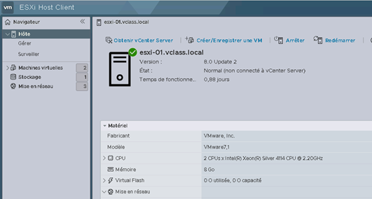

# Scénario 1 : Migration d’un serveur ESXi autonome
## Atelier 1 : Vérification de l’existant
1. Connectez vous au Host-Client de votre serveur ESXi :
   1. Ouvrez **Firefox** (Il y a un raccourcis dans la barre des tâches de votre machine « Student »)
   2. Dans la barre personnelle de Firefox, ouvrez le dossier « **Scénario 1**» et choisissez « **ESXi-01** »
   3. Identifiez vous en tant que “**root”**  
        
1. Vérifiez la connectivité réseau de vos 2 VMs vers leur passerelle respective (ping) en vous connectant en console sur chacune de ses VMs :
   1. Prod-01 :
       - Utilisateur : localadmin
       - Adresse de passerelle : 172.20.11.254        
        
    2. Test-01 :
       - Utilisateur : localadmin
       - Adresse de passerelle : 172.20.111.254  
        
1. Vérifier la non-connectivité entre ces deux VMs :
    - Pour récupérer l’adresse IP :
        - Windows : ipconfig
        - Ubuntu : ip a
    Notez au passage le nom de l’interface réseau : **ens160**
    Ce nom d’interface risque de changer après la migration de la VM. Il faudra certainement adapter la configuration réseau de la machine  
    
1. Poursuite du test  
# Scénario
*Ib Cegos Workshop* a donc acheté un nouveau nom de domaine DNS pour son projet pilote (fourni par votre hébergeur d'ateliers) qui soit utilisable sur Internet.
ICW gère directement les enregistrements de ses domaines DNS. Pour que ce domaine soit utilisable sur le tenant, il va vous falloir passer par un assistant de configuration et créer les enregistrements DNS attendus. C'est ce que vous allez réaliser dans ce troisième exercice.
## Avant de commencer
Votre formateur/trice pourra, le cas échéant, vous donner quelques indications complémentaires concernant l'environnement d'atelier a distance que vous utiliserez.  
dans votre environnement d'atelier, goDeploy vous fournit un nom de domaine DNS d'entreprise pour le projet pilote. Vous pouvez identifier ce nom de domaine en tête de l'onglet **DNS** dans l'environnement d'atelier.
> **Note** : L'onglet **DNS** ne se trouve pas dans la machine virtuelle mais à sa gauche, dans le portail goDeploy.  
## Tâche 1 - Ajout du DNS d'entreprise
Dans cette tâche vous allez ajouter le domaine DNS d'entreprise à votre tenant Microsoft 365.
5. Les opérations sont à faire sur **LON-DC1**, connecté avec le compte **Administrator**.
1. Dans votre navigateur Internet, vous devriez toujours être sur le portail **Microsoft 365 admin center**, connecté avec le compte *MOD Administrator*.
1. Dans le portail **Microsoft 365 admin center**, dans le menu de navigation, vous avez déjà ouvert le groupe **Settings** pour l'exercice précédant. Pour ajouter le domaine d'entreprise, cliquez sur **Domains** dans ce groupe.
1. Sur la page **Domains**, vous devriez voir apparaitre le domaine par défaut, créé avec votre tenant ([onmicrosoftDomain].onmicrosoft.com).
1. Cliquez sur **+ Add domain** pour ouvrir la page **Add a domain**.
1. Sur la page **Add a domain**, saisissez le **nom DNS d'entreprise** (```[godeployDomain].godeploylabs.com```) dans le champ **Domain name** avant de cliquer sur le bouton **Use this domain**.
1. Sur la page **Verify you own your domain**, sélectionnez l'option **Add a TXT record to the domain's DNS record** et cliquez sur **Continue**.
1. Sur la page **Add a record to verify ownership**, prenez note de la valeur mentionnée après **TXT value**. Elle devrait ressembler à *MS=msXXXXXXXX*.
1. Dans l'environnement d'atelier, ouvrer l'onglet **DNS** et cliquez sur **Add New +** dans la section **TXT Records**
1. Dans la fenêtre **Add DNS TXT Record**, tapez **@** dans le champ **Name** et la valeur notée au point précédent dans le champ **Value** avant de cliquer sur **Save**.
1. De retour dans la machine virtuelle **LON-DC1**, Sur la page **Add a record to verify ownership**, cliquez sur le bouton **Verify**.
1. Sur la page **How do you want to connect to your domain?**, cliquez sur le bouton **Continue** pour ouvrir la page **Add DNS records**.
1. La page **Add DNS records** identifie les services qu'une entreprise peut implémenter dans le contexte de son déploiement Microsoft 365 et qui ont besoin d'enregistrements DNS. L'option **Exchange and Exchange Online Protection** devrait être sélectionnée par défaut (sinon, sélectionnez là).
	> Trois enregistrements DNS sont nécessaires pour les services Exchange - un enregistrement **MX** , un alias **CNAME**, et un enregistrement **TXT**. Sélectionnez chaque enregistrement pour l'ouvrir et prendre note de son contenu à créer.  
    - MX ( de nom ```@```) pointe vers ```[godeployDomain]-godeploylabs-com.mail.protection.outlook.com``` avec préférence de **0**  
    - CNAME associe ```autodiscover``` à ```autodiscover.outlook.com```  
    - TXT ( de nom ```@```) contient ```v=spf1 include:spf.protection.outlook.com -all```  
1. Plus bas, dans la page **Add DNS records**, cliquez sur **Advanced Options**.
1. Trois services additionnels sont affichés ici : **Skype for Business**, **Intune and Mobile Device Management for Microsoft 365** et **DomainKeys Identified Mail (DKIM)**.  
	> Sélectionnez les cases à cocher des deux premiers services, cela va faire apparaître un ensemble d'enregistrements DNS à créer pour chacun.
1. Notez que quatre enregistrements DNS sont requis pour **Skype for Business** - deux **CNAME** et deux **SRV**. Sélectionnez chaque enregistrement pour l'afficher et en prendre note  
	> **Important :** Bien que Teams soit désormais utilisée comme plateforme de collaboration et de conversation en temps réel, il reste nécessaire de sélectionner **Skype for Business**. La raison en est que Teams va s'appuyer sur ces enregistrements DNS pour diverses fonctionnalités qui ne fonctionneront pas correctement sans.  
    - CNAME associe ```sip``` à ```sipdir.online.lync.com```  
    - CNAME associe ```lyncdiscover``` à ```webdir.online.lync.com```  
    - SRV ```_sip._tls``` cible ```sipdir.online.lync.com``` (Priorité **100**, poids **1** et port ```443```)  
    - SRV ```_sipfederationtls._tcp``` cible ```sipfed.online.lync.com``` (Priorité **100**, poids **1** et port ```5061```)  
1. Notez que deux alias CNAME sont nécessaires au fonctionnement correct de **Intune and Mobile Device Management for Microsoft 365**. Sélectionnez **CNAME Record (2)** pour les afficher et prenez bonne note de leur contenu.  
    - CNAME associe ```enterpriseregistration``` à ```enterpriseregistration.windows.net```  
    - CNAME associe ```enterpriseenrollment``` à ```enterpriseenrollment-s.manage.microsoft.com``` (selon les tenants, peut aussi être associé à ```enterpriseenrollment.manage.microsoft.com```).  
1. Retournez dans l'onglet **DNS** de votre environnement d'atelier et créez-y tous les enregistrements DNS nécessaires pour le tenant du projet pilote.
1. De retour dans la machine virtuelle **lon-DC1**, cliquez sur le bouton **Continue**. A ce moment, l'assistant de création du domaine va vérifier que tous les enregistrements DNS nécessaires ont correctement été créés.
1. Si tous les enregistrements DNS attendus ont été correctement crées, la page **Domain setup is complete** devrait apparaître (Dans le cas contraire, merci de vérifier les enregistrement DNS manquant/erronés indiqués sur la page **Add DNS records** qui s'est réaffichée, avant de cliquer de nouveau sur **Continue**).
1. Cliquez sur **Done**.
1. Vous allez être renvoyé vers la page **Domains** dans laquelle la colonne **status** pour votre DNS d'entreprise devrait afficher **Healthy**.  
    ## Tâche 2 - Définition du domaine par défaut
    Dans un contexte de production, il serait pertinent que le nouveau domaine que nous venons d'ajouter soit le domaine par défaut de l'environnement 365.  
    Pour notre pilote, il sera plus simple de repasser le domaine [onmicrosoftDomain].onmicrosoft.com en domaine par défaut.
1. Sur la page **Domains**, cliquez sur les trois points verticaux en regard du domaine **[onmicrosoftDomain].onmicrosoft.com**
1. Cliquez sur le choix **Set as default**
1. Sur le popup **Set this domain as default?** cliquez sur le bouton **Set as default**
1. Assurez-vous que, dans la liste des domaines, c'est bien le domaine **[onmicrosoftDomain].onmicrosoft.com** qui porte désormais la mention *(Default)*.

## Résultat
A l'issue de ce troisième exercice, vous avez mis en place tous les enregistrements DNS nécessaires au bon fonctionnement des services Microsoft 365 pour le projet pilote de ICW.

# Fin de l'atelier 1