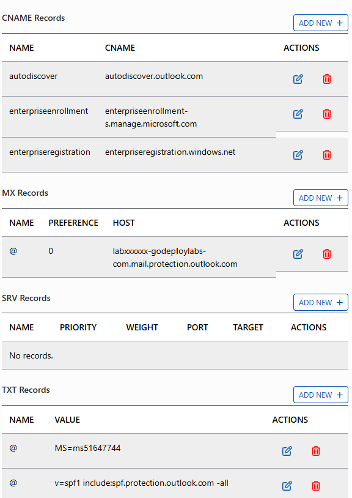

# Scénario
Adatum a donc acheté un nouveau nom de domaine DNS pour son projet pilote (fourni par votre hébergeur d'ateliers) qui soit utilisable sur Internet.
Adatum gère directement les enregistrements de ses domaines DNS. Pour que ce domaine soit utilisable sur le tenant, il va vous falloir passer par un assistant de configuration et créer les enregistrements DNS attendus. C'est ce que vous allez réaliser dans ce second exercice.

Vous allez commencer par vous connecter sur la machine cliente **LON-CL1** en utilisant le compte administrateur local **Adatum\administrator** pour ensuite vous connecter au tenant Microsoft 365 avec le compte **MOD Administrator**. Vous allez ensuite mettre à jour le profil de l'entreprise Adatum, et vous preparerez le tenant pour Entra ID et pour les futurs ateliers utilisant *Information Rights Management*, les alertes d'audit, le module Powershell *Graph* et les labels de sensibilité.  

# Objectifs
A la fin de cet exercice, vous aurez une meilleure connaissance de :
- lL'ajout d'un domaine DNS d'entreprise à un tenant Microsoft 365  

## Avant de commencer
Votre formateur/trice pourra, le cas échéant, vous donner quelques indications complémentaires concernant l'environnement d'atelier a distance que vous utiliserez.  
dans votre environnement d'atelier, goDeploy vous fournit un nom de domaine DNS d'entreprise pour le projet pilote. Vous pouvez identifier ce nom de domaine en tête de l'onglet **DNS** dans l'environnement d'atelier.
    > **Note** : L'onglet **DNS** ne se trouve pas dans la machine virtuelle mais à sa gauche, dans le portail goDeploy.  
Identifiez le **nom DNS d'entreprise** qui vous a été attribué, il devrait ressembler à *labXXXXXXXX.godeploylabs.com* et prenez-en bonne note.

## Tâche 1 - Ajout du DNS d'entreprise
Dans cette tâche vous allez ajouter le domaine DNS d'entreprise à votre tenant Microsoft 365. 
1. A l'issue du précédent exercice, vous devriez être connecté sur **LON-DC1** avec le compte **Administrator**.
1. Dans votre navigateur Internet, vous devriez toujours être sur le portail **Microsoft 365 admin center**, connecté avec le compte *MOD Administrator*.
1. Dans le portail **Microsoft 365 admin center**, dans le menu de navigation, vous avez déjà ouvert le groupe **Settings** pour l'exercice précédant. Pour ajouter le domaine d'entreprise, cliquez sur **Domains** dans ce groupe. 
1. Sur la page **Domains**, vous devriez voir apparaitre le domaine par défaut, créé avec votre tenant (se terminant par *.onmicrosoft.com*).
1. Cliquez sur **+ Add domain** pour ouvrir la page **Add a domain**.
1. Sur la page **Add a domain**, saisissez le **nom DNS d'entreprise** dans le champ **Domain name** avant de cliquer sur le bouton **Use this domain**.
1. Sur la page **Verify you own your domain**, sélectionnez l'option **Add a TXT record to the domain's DNS record** et cliquez sur **Continue**.
1. Sur la page **Add a record to verify ownership**, prenez note de la valeur mentionnée après **TXT value**. Elle devrait ressembler à *MS=msXXXXXXXX*.
1. Dans l'environnement d'atelier, ouvrer l'onglet **DNS** et cliquez sur **Add New §** dans la section **TXT Records**
1. Dans la fenêtre **Add DNS TXT Record**, tapez **@** dans le champ **Name** et la valeur notée au précédent dans le champ **Value** avant de cliquer sur **Save**.
1. De retour dans la machine virtuelle **LON-DC1**, Sur la page **Add a record to verify ownership**, cliquez sur le bouton **Verify**.
1. Suyr la page **How do you want to connect to your domain?**, sélectionnez **More options**. Deux options s'affichent : **Add your own DNS records**, et **Skip and do this later (not recommended)**. L'option **Add your own DNS records** est sélectionnée par défaut, cliquez sur le couton **Continue** pour ouvrir la page **Add DNS records**.
1. La page **Add DNS records** identifie les services qu'une entreprise peut implémenter dans le contexte de son déploiement Microsoft 365 et qui ont besoin d'enregistrements DNS. L'option **Exchange and Exchange Online Protection** devrait être sélectionnée par défaut (sinon, sélectionnez là).
	> Trois enregistrements DNS sont nécessaires pour les services Exchange - un enregistrement **MX** , un alias **CNAME**, et un enregistrement **TXT**. Sélectionnez chaque enregistrement pour l'ouvrir et prendre note de son contenu à créer. 
1. Plus bas dans la page **Add DNS records** cliquez sur **Advanced Options**.
1. Deux services additionnels sont affichés ici : **Skype for Business** et **Intune and Mobile Device Management for Microsoft 365**.  
	> Sélectionnez les cases à cocher de ces deux services, cela va faire apparaître un ensemble d'enregistrements DNS à créer pour chacun.
1. Notez que quatre enregistrements DNS sont requis pour **Skype for Business** - deux **CNAME** et deux **SRV**. Sélectionnez chaque enregistrement pour l'afficher et en prendre note  
	> **Important :** Bien que Teams soit désormais utilisée comme plateforme de collaboration et de conversation en temps réel, il reste nécessaire de sélectionner **Skype for Business**. La raison en est que Teams va s'appuyer sur ces enregistrements DNS pour diverses fonctionnalités qui ne fonctionneront pas correctement sans. 
1. Notez que deux alias CNAME sont nécessaires au fonctionnement correct de **Intune and Mobile Device Management for Microsoft 365**. Sélectionnez **CNAME Record (2)** pour les afficher et prenez bonne note de leur contenu.
1. Retournez dans l'onglet **DNS** de votre environnement d'atelier et créez-y tous les enregistrements DNS nécessaires pour le tenant du projet pilote.
    > **Note** : Voici un exemple d'onglet DNS contenant les enregistrements nécessaires créés pour vous aider : il vous faudra cependant remplacer la mention labXXXXXX par votre nom DNS d'entreprise :
    
1. De retour dans la machine virtuelle **lon-DC1**, cliquez sur le bouton **Continue**. A ce moment, l'assistant de création du domaine va vérifier que tous les enregistrements DNS nécessaires ont correctement été créés.
1. Si tous les enregistrements DNS attendus ont été correctement crées, la page **Domain setup is complete** devrait apparaître (Dans le cas contraire, merci de vérifier les enregistrement DNS manquant/erronés indiqués sur la page **Add DNS records** qui s'est réaffichée, avant de cliquer de nouveau sur **Continue*). Cliquez sur **Done**.
1. Vous allez être renvoyé vers la page **Domains** dans laquelle la colonne **status** pour votre DNS d'entreprise devrait afficher **Healthy**.  
1. Restez connecté sur LON-DC1 VM et laissez votre navigateur Internet ouvert pour l'exercice suivant de vos ateliers.

## Résultat
A l'issue de ce second exercice, vous avez mis en place tous les enregistrements DNS nécessaires au bon fonctionnement des services Microsoft 365 pour le projet pilote de Adatum.

Vous pouvez poursuivre par [l'exercice 3 -Visite des portails administratifs 365](lab1e3)